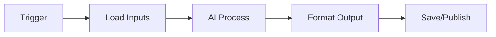

# <Gig / Idea Name>

## Dates
- Created: YYYY-MM-DD
- Last Updated: YYYY-MM-DD
- Current Stage: Backlog | Testing | Active | Complete

## AI Company
- Company:
- Model(s):
- Owner:

## Goal
Short statement of what this idea should accomplish.

## Inputs
- weather.json
- news.json
- reminders.json
- email_watch.json
- settings.json

## Output
What this idea generates and where it is saved.

## Workflow Diagram (Horizontal)

## Milestones
- YYYY-MM-DD — Idea created
- YYYY-MM-DD — First workflow draft
- YYYY-MM-DD — First successful run
- YYYY-MM-DD — Production-ready

## Notes Learned
- What worked:
- What failed:
- What to improve:
