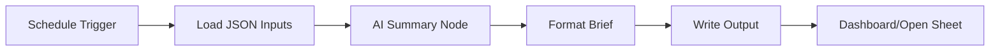
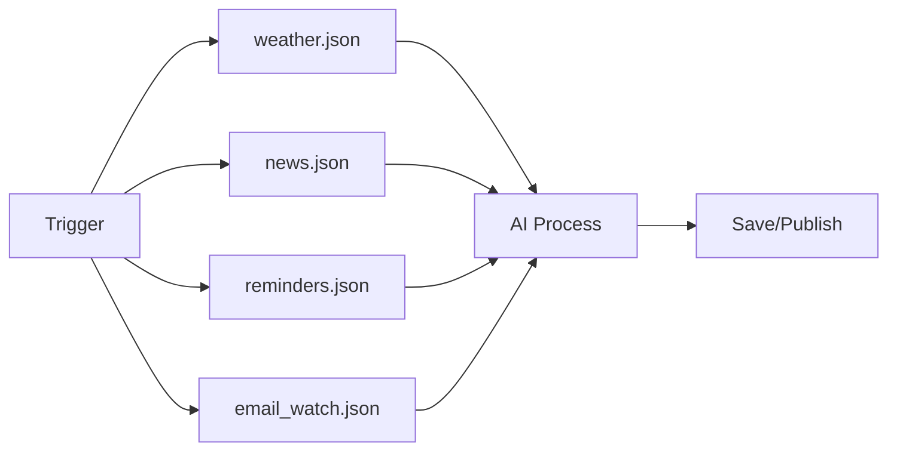
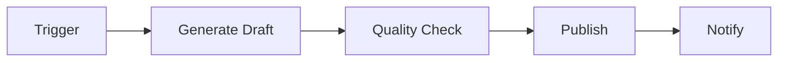

# Workflow Diagram Templates (Horizontal)

All diagrams below are left-to-right (`flowchart LR`).

## Standard Morning Brief Flow

```mermaid
flowchart LR
    A[Schedule Trigger] --> B[Load JSON Inputs]
    B --> C[AI Summary Node]
    C --> D[Format Brief]
    D --> E[Write Output]
    E --> F[Dashboard/Open Sheet]
```

## Multi-Source Input Flow

```mermaid
flowchart LR
    A[Trigger] --> B[weather.json]
    A --> C[news.json]
    A --> D[reminders.json]
    A --> E[email_watch.json]
    B --> F[AI Process]
    C --> F
    D --> F
    E --> F
    F --> G[Save/Publish]
```

## Review and Notify Flow

```mermaid
flowchart LR
    A[Trigger] --> B[Generate Draft]
    B --> C[Quality Check]
    C --> D[Publish]
    D --> E[Notify]
```
